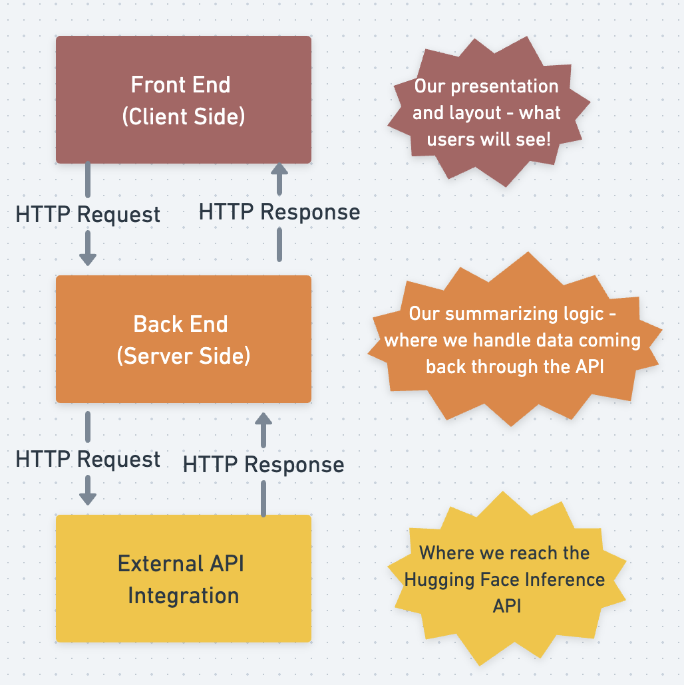

# AI-Powered Text Summarizer App
This is a Project-Based learning tutorial from Postman. 

## Functionalities
- The user is prompted to insert text that they wish to summarize.
- The user can submit their text with a "summarize" button and receive an AI-powered summary in an output textarea.

## Structure of the App
The app will have a client side (website), server side, and external API integration to `Hugging Face`.

